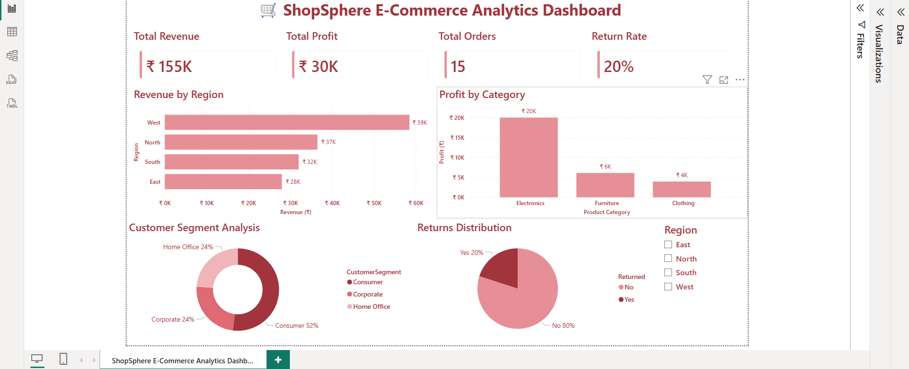

# ShopSphere E-Commerce Analytics Dashboard

## Overview

ShopSphere E-Commerce Analytics Dashboard is an interactive analytics project built using Excel, SQL, Power BI, Python, and Streamlit.

The dashboard helps analyze sales performance, profitability, customer segments, return rates, and regional business performance.

---

## Features

- Revenue Analysis
- Profit Analysis
- Customer Segment Analysis
- Returns Analysis
- Regional Performance Tracking
- Interactive Dashboard
- KPI Monitoring

---

## Dashboard Metrics

- Total Revenue
- Total Profit
- Total Orders
- Return Rate

---

## Visualizations

### Revenue by Region
Analyze revenue generated across different regions.

### Profit by Category
Compare profit performance among product categories.

### Customer Segment Analysis
Understand revenue contribution from each customer segment.

### Returns Distribution
Monitor product return trends and return rates.

---

## Tools Used

- Excel
- SQL
- Power BI
- Python
- Streamlit
- Plotly

---

## Business Insights

- West region generated the highest revenue.
- Electronics category generated the highest profit.
- Consumer segment contributed the highest revenue share.
- Return rate remained at 20%.

---

## Deployment

Streamlit Cloud

---

## Dashboard Preview

